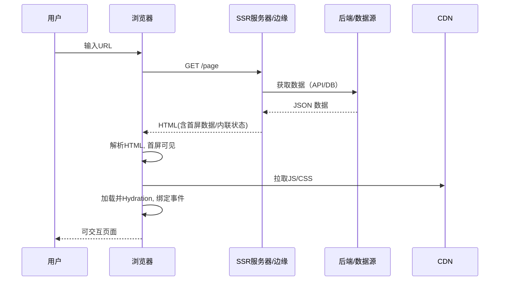
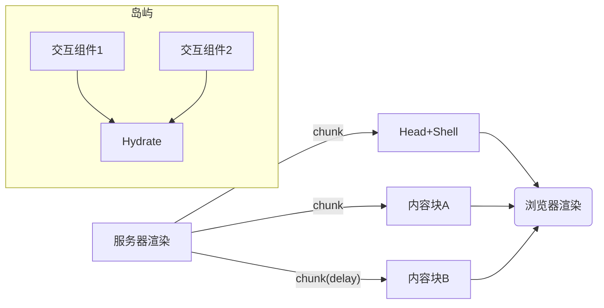

# SSR 渲染原理与适用场景

> 目标：理解服务端渲染（SSR）的工作原理、性能/SEO收益与代价，掌握流式/局部水合/边缘渲染等实践与适用边界。

## 面试者视角（怎么答）

### 1) SSR 原理总览（与 CSR/SSG 的关系）
- 定义：SSR 是在服务器将应用渲染为 HTML 返回，浏览器接收后解析并进行“水合（Hydration）”以接管交互。
- 生命周期（与 CSR 对比）：
  1) 请求到达服务器；
  2) 服务端拉取数据并渲染模板/组件树为 HTML；
  3) 将 HTML（含首屏数据）返回，浏览器“秒开”可见内容；
  4) 客户端加载 JS，完成水合，绑定事件与状态，进入可交互状态。
- 与 SSG/ISR：
  - SSG：构建期“离线”生成 HTML；适合内容稳定页面。
  - ISR（增量静态再生）：在边缘/服务端按 TTL 重新生成，兼顾时效与静态缓存。

#### SSR 请求-响应-水合流程


- 首屏数据注入：常见通过 `window.__INITIAL_STATE__` 或 `<script type="application/json" id="ssr-state">{...}</script>` 传递；需避免 XSS（对 `</script>`/`<` 转义，或使用 JSON script）。

### 2) 性能与缓存（TTFB/LCP 的权衡）
- 收益：
  - 更快的“可见内容”（LCP 通常下降），搜索引擎更友好（SEO/OG 标签）；
  - 首次请求无需等待客户端 JS 执行即可呈现页面骨架与内容。
- 成本：
  - TTFB 可能上升（服务器渲染与数据等待）；
  - 客户端水合成本（JS 仍需下载/解析/执行，交互延迟可能增加）。
- 缓存策略：
  - 全页缓存：对匿名页面可在 CDN 缓存 HTML（`Cache-Control: s-maxage`/`stale-while-revalidate`），命中则显著降低 TTFB；
  - 数据缓存：对个性化页面，缓存接口/片段（BFF 缓存、Edge KV/Cache），SSR 只做拼装；
  - ETag/304：对 HTML 走协商缓存；
  - 边缘分层缓存：Edge→Regional/Shield→Origin，降低回源。

### 3) 流式 SSR（Streaming）与渐进水合
- 流式输出：服务器以分块（chunked）形式尽快输出 head/骨架/关键内容，浏览器边收边渲染；减少“白屏时间”。
- Suspense/占位：等待慢数据时先输出占位，后续再流式补齐。
- 渐进/部分水合：仅对可交互“岛”（Island）附加 JS；非交互区域保持纯 HTML，显著减少客户端 JS 体积与水合成本。

#### 流式 SSR/岛屿架构（示意）


### 4) 数据获取与同构（Isomorphic）
- 每次请求都要“无副作用地”构建应用实例（`createApp` 工厂模式），避免全局单例泄漏到并发请求间；
- 服务端数据：
  - SSR 前置拉取（阻塞渲染），将状态注入初始 HTML；
  - 客户端再取（SWR）校准，保证一致性；
- BFF（Backend for Frontend）：在服务端拼装多个后端数据，缩短往返并统一缓存与重试策略。

### 5) 安全与稳定性
- XSS：序列化状态时严格转义；CSP（`script-src`）配合 nonce；
- 故障回退：SSR 失败时回退 CSR（返回基础 HTML+客户端拉取）；设置服务器超时与熔断；
- 资源提示：`preconnect/modulepreload/preload` 降低水合依赖的时延；
- 监控：RUM（TTFB/LCP/INP）、SSR 命中率、错误率、Edge/Origin 占比，异常自动回滚。

### 6) 适用场景与选型建议
- 适合：
  - 内容/营销/文档/活动页（SEO 强需求）；
  - 社交分享（OG/Twitter meta 需要首屏 HTML）；
  - 电商/搜索结果页（首屏感知性能要求高）；
  - 需要边缘/区域性分发加速的全球化站点。
- 不适合/谨慎：
  - 重度互动后台工具（复杂客户端状态，水合成本高）；
  - 强用户个性化的页面（CDN 难以缓存整页，需做片段/数据缓存与边缘计算）；
  - 低算力服务器或极端高并发但无缓存的场景（TTFB 容易飙升）。
- 组合拳：
  - SSR + 流式 + 岛屿（交互局部水合）
  - SSG/ISR 用于稳定内容，CSR 用于工具型模块。

### 7) Vue/React 实践要点（框架无关型）
- 每请求 `createApp()` 返回全新 app/router/store 实例；
- 路由匹配后收集需要的异步数据（组件 `asyncData`/路由守卫），注入到 store；
- `renderToString`/`renderToNodeStream` 输出 HTML，并内联状态脚本；
- 客户端 `hydrate` 时用相同 router/store 启动，读取 `INITIAL_STATE` 恢复。

---

## 面试官视角（怎么问、看什么）

### 可追问清单（附考点）
- SSR 与 CSR/SSG/ISR 的取舍？
  - 考点：TTFB vs LCP、SEO、缓存策略、发布复杂度、成本。
- 如何避免水合不匹配？
  - 考点：仅在浏览器可用的 API 放在 `onMounted`，时间/随机数一致性，条件渲染对齐，`suppressHydrationWarning` 的边界（如有）。
- 流式 SSR 如何落地？
  - 考点：分块输出、flush 边界、占位/错误边界、与 CDN 压缩/缓冲的交互、早期写出 head 与关键 CSS。
- CDN 缓存 HTML 的策略？
  - 考点：匿名页可缓存、`Vary` 白名单、`stale-while-revalidate`、个性化片段用 ESI/边缘 KV+BFF。
- 边缘渲染（Edge SSR） vs Origin SSR？
  - 考点：冷启动/资源限制、近场加速、平台差异（Node/Workers Runtime）、调试与观测。
- 安全与风控？
  - 考点：XSS 序列化、CSP nonce、机密不下发、速率限制与熔断、异常回退到 CSR。

### 评估要点
- 有清晰的渲染/数据/缓存/回退链路；有可观测性与回滚；能量化收益与成本。

### 红旗信号
- 所有页面“一刀切”开 SSR；无缓存/无回退导致线上雪崩；水合频繁报错；状态/单例跨请求污染。

---

## 代码与配置片段

### Node + Express 极简 SSR（伪代码/框架无关）
```ts
// server.ts
import express from 'express'
import { createApp } from './server-entry'
import { renderToString } from 'some-ssr-renderer'

const app = express()
app.get('*', async (req, res) => {
  try {
    const { appInstance, router, store } = createApp({ url: req.url })
    await router.isReady?.()
    // 路由匹配组件的服务端数据拉取
    const matched = router.getMatchedComponents?.() || []
    for (const c of matched) {
      if (c.asyncData) await c.asyncData({ store, route: router.currentRoute })
    }
    const html = await renderToString(appInstance)
    const state = JSON.stringify(store.state).replace(/</g, '\\u003c')
    res.set('Cache-Control', 'public, max-age=60, stale-while-revalidate=120')
    res.end(`<!doctype html><html><head>...</head><body>
      <div id="app">${html}</div>
      <script id="__STATE__" type="application/json">${state}</script>
      <script src="/client.bundle.js" type="module"></script>
    </body></html>`)
  } catch (e) {
    // 回退 CSR
    res.status(200).end(`<!doctype html><html><body><div id="app"></div>
      <script src="/client.bundle.js" type="module"></script></body></html>`)
  }
})
app.listen(3000)
```

### 客户端入口（水合）
```ts
// client-entry.ts
import { createApp } from './client-app'
const el = document.getElementById('app')!
const stateEl = document.getElementById('__STATE__') as HTMLScriptElement | null
const state = stateEl ? JSON.parse(stateEl.textContent || '{}') : {}
const { app, store, router } = createApp()
store.replaceState?.(state)
router.isReady?.().then(() => app.mount(el, true)) // true=hydrate
```

### 流式输出（Node 示例）
```ts
// 以 Node stream 逐步写出，提高首字节与首屏感知
res.write('<!doctype html><html><head>...</head><body><div id="app">')
const stream = renderToNodeStream(appInstance)
stream.on('data', chunk => res.write(chunk))
stream.on('end', () => {
  res.end('</div><script src="/client.bundle.js" type="module"></script></body></html>')
})
```

---

## 实战清单（落地步骤）
- 架构：为每个请求创建应用实例（router/store），剥离全局单例；SSR 失败回退 CSR。
- 数据：建立 SSR 数据拉取规范与 BFF 缓存策略；客户端 SWR 校准。
- 性能：开启流式SSR；首屏关键 CSS/字体 `preload`；采用岛屿/局部水合减少 JS。
- 缓存：匿名页 HTML 走 CDN `s-maxage+SWR`；个性化页缓存接口/片段；ETag/304 协商。
- 安全：序列化转义、CSP nonce；不下发机密；速率限制与熔断。
- 观测：RUM（TTFB/LCP/INP）、SSR 命中与错误、Edge/Origin 分布；异常一键回滚。

## 常见坑
- 水合不匹配（服务端与客户端标记/时间/随机不一致）；
- 单例/可变全局状态污染并发请求；
- 未做缓存导致 TTFB 抖动；流式输出被中间件缓冲；
- 注入状态未转义引发 XSS；
- 边缘/Node 运行时差异（不可用 API）导致崩溃。

## 总结
- SSR 的核心是“服务器先渲染、客户端再接管”，收益在于首屏与 SEO，代价在于服务器开销与水合成本。通过流式/岛屿、BFF 缓存与边缘渲染、良好的回退与观测，才能在正确场景中稳定发挥 SSR 的价值。
