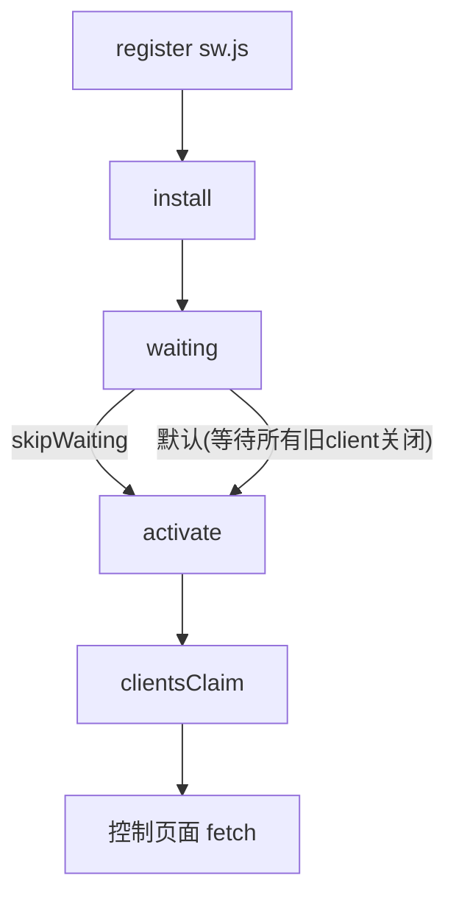

# Service Worker 详解与使用场景

> 目标：掌握 Service Worker（SW）的工作原理、缓存与离线策略、更新机制与风险，清楚它在性能、可靠性、能力扩展（Push/Sync）的适用边界。

## 快速上手（通俗版）
- 一句话它是啥：运行在浏览器背后的“迷你代理服务器”。它能拦截页面的网络请求，优先用本地缓存，没网也能给你兜底，还能在后台做同步和推送。
- 能做什么：
  - 让静态资源“秒开”并可离线（JS/CSS/字体/图）
  - HTML 壳子先显示，数据稍后再更新（减少白屏）
  - 离线时把用户操作排队，网络恢复后自动重试
  - 后台推送通知（需用户授权）
- 不能做什么：
  - 不能跨站点随意拦截；不能绕过 HTTPS；不该缓存敏感/个性化数据

- 三种常用策略（口语版）：
  1) cache-first（先看家里有没有）→ 命中就直接用，适合带哈希的静态资源
  2) network-first（先问外面有没有新的）→ 一致性优先，适合重要接口/最新数据
  3) stale-while-revalidate（先用旧的，同时去拿新的）→ 体验与新鲜度兼顾，适合 HTML 壳/非关键数据

- 一次页面加载会发生什么：
  1) 首次访问：页面注册 SW；SW 安装时把核心文件预缓存（可离线）
  2) 之后访问：页面发请求→SW 接住→按策略决定“用缓存/去网络/边用边刷”，成功的新响应会回写到缓存

- 更新到底怎么生效：
  - 浏览器发现 sw.js 变了→安装“新 SW”但先等待（old、新并存）
  - 默认：等旧页面都关了再接管；
  - 主动：你可以 `skipWaiting+clientsClaim` 立刻接管，但应提示用户“有新版本，点刷新”

- 什么时候该用/不该用：
  - 用：需要 PWA/离线、全球弱网用户、读多写少的页面、静态资源较重的站点
  - 慎用：强一致复杂后台、频繁变更的个性化 HTML、对版本一致性极敏感的关键流程（要设计好更新提示）

- 五步落地（最简实践）：
  1) 注册 SW（`/sw.js` 放在站点根）
  2) 预缓存首页壳和打包产物（带哈希）
  3) 静态资源走 cache-first；HTML 壳走 SWR；API 走 network-first + 离线回退
  4) 缓存名带版本，`activate` 清理旧缓存
  5) 有新版本时弹条提示“点击刷新”

## 面试者视角（怎么答）

### 1) 核心原理与生命周期
- 作用域：以注册路径为根（`/sw.js` 作用于站点根，`/app/sw.js` 仅子路径）。拦截同源 `fetch`、监听 `install/activate/fetch/push/sync` 等事件。
- 生命周期：`register → installing → installed(waiting) → activating → activated`，新旧 SW 并存，需处理接管与更新策略。
- 更新触发：浏览器定期拉取 sw 脚本并比对字节差异；变更即进入安装/等待流程。

#### SW 生命周期与更新（示意）


### 2) 缓存策略（按资源/数据类型选择）
- 静态打包产物：`cache-first`（哈希文件）→ 命中率高、可离线；配合构建产物版本化。
- HTML/路由壳：`stale-while-revalidate`（先返回缓存，再后台刷新）或 `network-first`（一致性优先）。
- API 数据：
  - 读多写少、可容忍陈旧 → `SWR` 或 `cache-first with revalidate`；
  - 一致性强 → `network-first`，离线回退。 
- 图片/字体：`cache-first` + `Cache-Control` 协同；大图可按策略限容（LRU）。

### 3) 版本与更新（避免“卡住旧版”）
- 版本化缓存名：`assets-v2025-10-21`；`activate` 时清理旧版本缓存。
- 更新交互：
  - 被动：默认等待旧页面全部关闭后接管；
  - 主动：`skipWaiting + clientsClaim` 立即接管，但需提示用户“更新可用，点击刷新”。
- 导航预加载（Navigation Preload）：在 `fetch` 前并行发起网络请求，缓解 `network-first` 的冷启动等待。

### 4) 能力扩展
- 背景同步（Background Sync）：离线提交排队，联网后自动重试（指数退避）。
- Push/通知：服务端推送消息，触发 `push` 事件并展示通知；需权限与订阅管理。
- Offline fallback：离线兜底页 + 关键路由壳预缓存。

### 5) 安全与限制
- 仅 HTTPS（或 localhost），同源限制；
- 不要缓存敏感/个性化数据（或加密/短期）；
- 谨慎 `skipWaiting`，避免在关键流程强切版本；
- 存储配额有限，需清理策略（LRU/限总量）。

### 6) 小结（30s）
- “SW 通过拦截 `fetch` 实现缓存/离线与后台能力。我们按资源选择 `cache-first/SWR/network-first`，用版本化缓存与 `skipWaiting` 提示刷新来安全更新，并用 Background Sync/Push 扩展可靠性与留存。”

---

## 面试官视角（怎么问、看什么）

### 可追问清单（附考点）
- 版本更新策略？
  - 考点：缓存名版本化、旧缓存清理、`skipWaiting/clientsClaim` 的触发与用户提示。
- 策略选择依据？
  - 考点：一致性 vs 可用性、资源类型（HTML/JS/API/图片）、弱网离线体验。
- 数据一致性与回退？
  - 考点：`network-first` 超时/失败回退、SWR 的陈旧容忍、离线兜底页。
- 存储与淘汰策略？
  - 考点：LRU/配额管理、按类型/域限容、清理时机。
- Push/Sync 的权限与隐私？
  - 考点：订阅生命周期、用户授权与撤回、重试与退避、通知骚扰控制。
- Workbox 还是手写？
  - 考点：维护成本、声明式路由、预缓存清单生成、调试与可观测性。

### 评估要点
- 是否分资源/数据制定策略；是否考虑更新与回退；是否有存储治理与监控；是否规避“陈旧内容”风险。

### 红旗信号
- 一个策略打天下；不清理旧缓存；强行 `skipWaiting` 导致流程中断；缓存敏感数据。

---

## 代码与配置片段

### 注册与基础骨架
```ts
// main.ts —— 注册 SW
if ('serviceWorker' in navigator) {
  window.addEventListener('load', () => {
    navigator.serviceWorker.register('/sw.js', { scope: '/' })
  })
}
```
```js
// sw.js —— 版本与预缓存
const CACHE_VER = 'assets-v2025-10-21'
const PRECACHE = [
  '/',
  '/index.html',
  '/assets/app.abc123.js',
  '/assets/style.abc123.css',
]
self.addEventListener('install', (e) => {
  e.waitUntil(caches.open(CACHE_VER).then((c) => c.addAll(PRECACHE)))
  self.skipWaiting() // 可选：安装后直接等待接管
})
self.addEventListener('activate', (e) => {
  e.waitUntil((async () => {
    const keys = await caches.keys()
    await Promise.all(keys.filter((k) => k !== CACHE_VER).map((k) => caches.delete(k)))
    self.clients.claim() // 立即接管控制权
  })())
})
```

### 路由壳 SWR 与静态 cache-first
```js
self.addEventListener('fetch', (e) => {
  const url = new URL(e.request.url)
  // 仅处理 GET
  if (e.request.method !== 'GET') return

  // 1) 静态资源：cache-first（哈希文件）
  if (/\/assets\/.+\.(?:js|css|woff2)$/.test(url.pathname)) {
    e.respondWith((async () => {
      const cache = await caches.open(CACHE_VER)
      const cached = await cache.match(e.request)
      if (cached) return cached
      const res = await fetch(e.request)
      if (res.ok) cache.put(e.request, res.clone())
      return res
    })())
    return
  }

  // 2) HTML/路由壳：SWR（先用缓存，后台刷新）
  if (url.pathname === '/' || url.pathname.endsWith('.html')) {
    e.respondWith((async () => {
      const cache = await caches.open(CACHE_VER)
      const cached = await cache.match(e.request)
      const fetchPromise = fetch(e.request).then((res) => {
        if (res.ok) cache.put(e.request, res.clone())
        return res
      }).catch(() => cached || Response.error())
      return cached || fetchPromise
    })())
    return
  }
})
```

### API：network-first + 离线回退
```js
self.addEventListener('fetch', (e) => {
  const url = new URL(e.request.url)
  if (url.pathname.startsWith('/api/')) {
    e.respondWith((async () => {
      try {
        const res = await fetch(e.request)
        // 可选：写入短期缓存
        const cache = await caches.open('api-short')
        cache.put(e.request, res.clone())
        return res
      } catch (err) {
        // 回退：使用最近一次成功响应（若有）
        const cache = await caches.open('api-short')
        const cached = await cache.match(e.request)
        if (cached) return cached
        return new Response(JSON.stringify({ offline: true }), {
          headers: { 'Content-Type': 'application/json' }, status: 503,
        })
      }
    })())
  }
})
```

### 背景同步（离线排队）
```js
// 页面：离线提交任务
async function enqueueUpload(task) {
  const reg = await navigator.serviceWorker.ready
  await reg.sync.register('upload-queue')
  // 把任务放入 IndexedDB，SW 读取并重试
}

// SW：
self.addEventListener('sync', (e) => {
  if (e.tag === 'upload-queue') {
    e.waitUntil((async () => {
      // 从 IndexedDB 读取任务，逐个重试，指数退避
    })())
  }
})
```

### 推送通知（概念示例）
```js
self.addEventListener('push', (e) => {
  const data = e.data ? e.data.json() : {}
  e.waitUntil(self.registration.showNotification(data.title || 'Update', {
    body: data.body, icon: '/icon.png', data: data.url,
  }))
})
self.addEventListener('notificationclick', (e) => {
  e.notification.close()
  e.waitUntil(clients.openWindow(e.notification.data || '/'))
})
```

### 导航预加载（Network-first 提升）
```js
self.addEventListener('activate', (e) => {
  e.waitUntil((async () => {
    if ('navigationPreload' in self.registration) {
      await self.registration.navigationPreload.enable()
    }
  })())
})
```

---

## 使用场景
- PWA/离线优先：低网/离线环境可访问核心流程；
- 全球/弱网用户：`cache-first` 提升静态资源命中；HTML 壳 SWR 减少白屏；
- 重型接口读：对浏览型/半实时数据做 SWR，节省带宽；
- 提交可靠性：离线排队 + 背景同步，提高成功率；
- 留存与召回：Push 通知（尊重隐私与频控）。

## 实战清单
- 为不同资源定义策略矩阵；缓存名版本化；清理旧缓存；
- 对更新设计“提示刷新”流程，避免强切；
- 观测：RUM（离线命中率、失败率）、SW 安装率、缓存大小；
- Workbox 评估：`injectManifest` 预缓存、`registerRoute` 声明式路由、`ExpirationPlugin` LRU。

## 常见坑
- 更新“卡旧版”：未提示刷新或未清理旧缓存；
- 过度缓存 HTML/个性化数据；
- 忽略存储上限，缓存不断膨胀；
- 在关键流程使用 `skipWaiting` 造成中断。

## 总结
- Service Worker 是“前端的边缘层”：把可缓存/可离线的内容前置到用户侧，以策略化的缓存与后台能力提升性能与可靠性。关键在于：按资源选策略、良好更新与提示、配额与安全约束，以及可观测性闭环。
