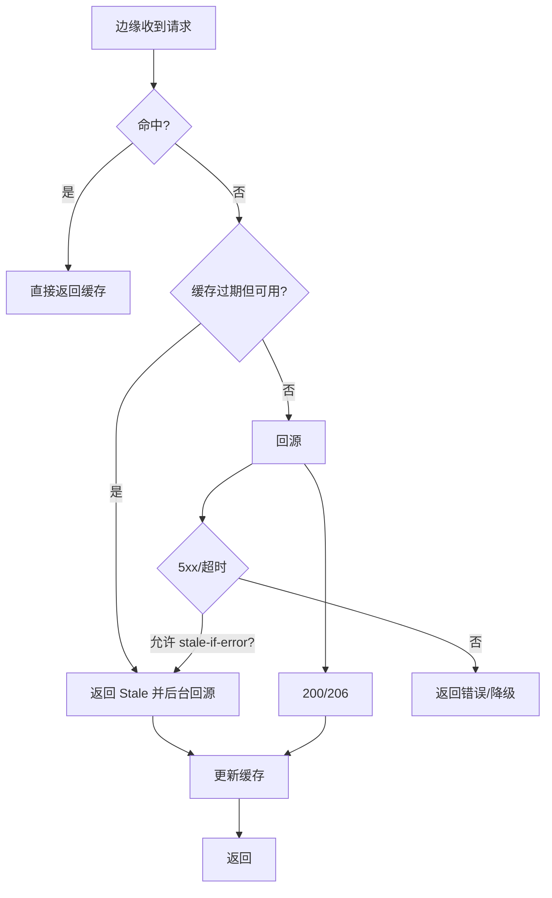
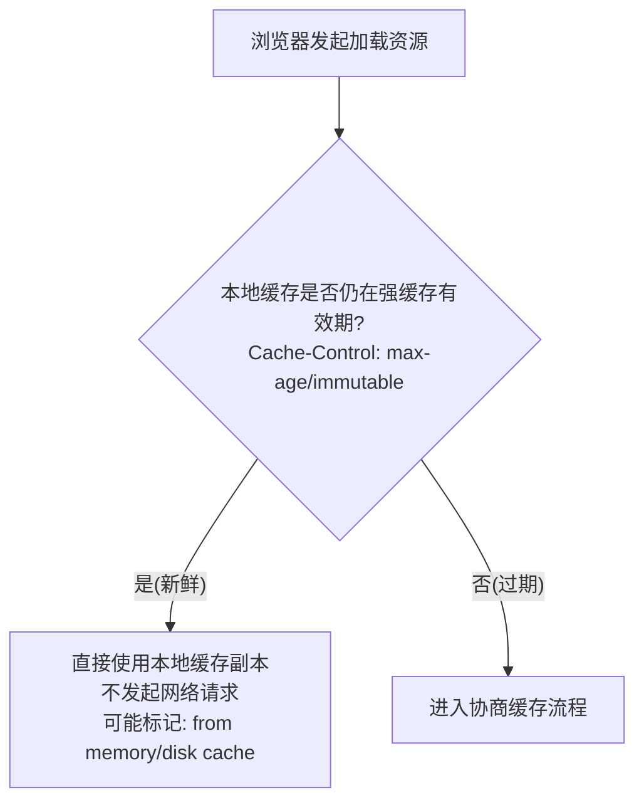
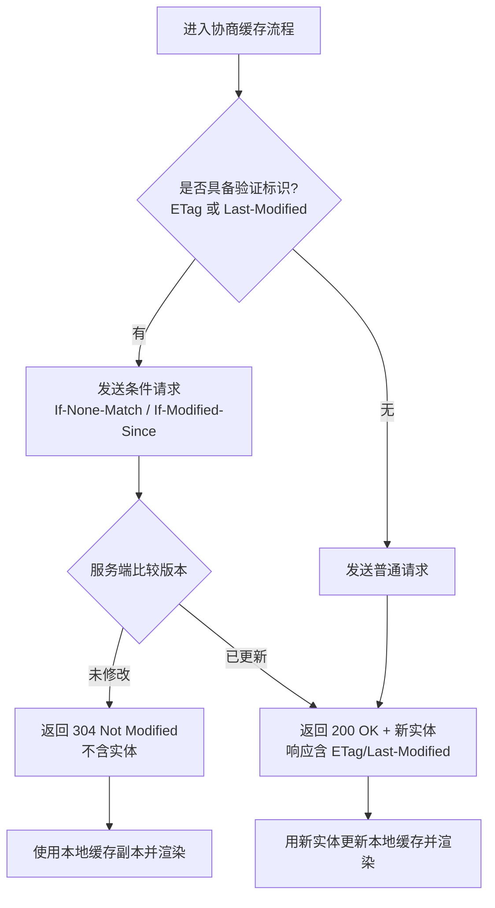
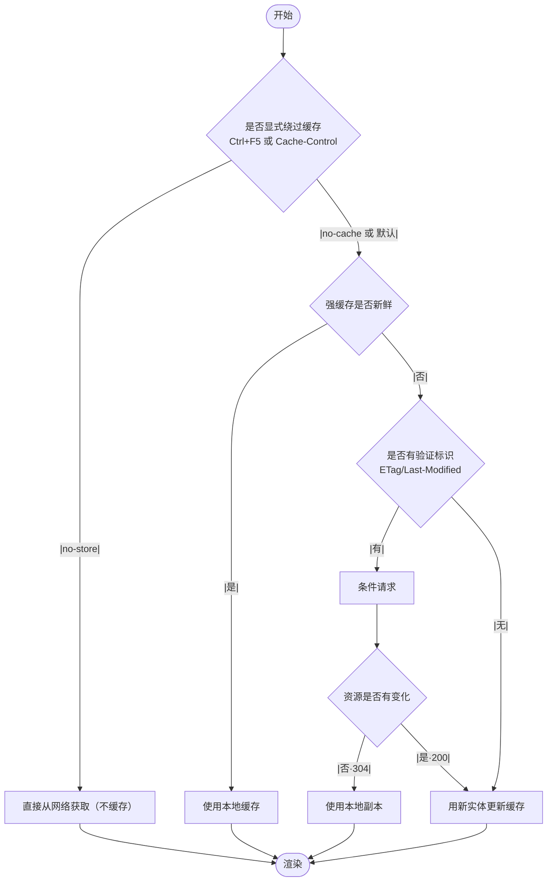

# 请求响应优化详解（CDN/浏览器缓存/连接与传输）

> 目标：降低首包/首屏时延、减少字节与请求数、提升稳定性与可用性，并以指标闭环验证（TTFB/LCP/INP/错误率/带宽）。

## 面试者视角（怎么答）

### 1) 指标与切片（先度量后优化）
- 指标口径：TTFB、LCP、INP/TTI、CLS，网络层看首包时延、TCP/TLS 耗时、重传率、缓存命中率（浏览器/CDN）。
- 人群切片：国家/运营商/设备/浏览器/首访 vs 回访；按页面/静态域/接口拆分。
- 看板与守门：构建产物体积预算、CDN 命中率阈值、RUM p75 目标与报警。

### 2) CDN 优化（边缘就近 + 缓存治理）
- 架构与路由：多 POP 就近解析（Anycast/GeoDNS）；HTTP/3(QUIC) 降低弱网握手损耗；启用 0-RTT/TLS1.3。
- 缓存键与分层缓存：
  - Cache Key = Host + Path + Query(白名单) + 关键头（如 `Accept-Encoding`/`Accept-Language`）。避免把 `Cookie/Authorization` 纳入缓存键。
  - 分层：边缘 POP → 区域（Regional/Shield）→ 源站，降低回源。
- TTL 与指令：
  - 静态产物：`Cache-Control: public, max-age=31536000, immutable` + 内容哈希文件名；CDN 层用 `s-maxage` 或 `Surrogate-Control`。
  - HTML/API：短缓存或不缓存；结合 `stale-while-revalidate`/`stale-if-error` 做容错。
- 命中率与回源控制：参数标准化（忽略无关 query）、小图雪碧或 CDN 变体裁剪、按 UA/地区做图片自适应（WebP/AVIF）。
- 失效与发布：内容哈希免刷新；紧急回滚用精确 Purge；大规模用前缀/Tag 失效。
- 边缘计算：在 Edge 重写/重定向、A/B、地理分流；轻量 SSR/ESI；减少跨洋回源。
- 安全与隔离：静态域去 Cookie；WAF/Rate Limit；源站 Shield；HSTS/HTTPS-only。


#### CDN 请求流转流程（示意）
```mermaid
flowchart TD
  A[用户浏览器] -- DNS 解析 --> B[GeoDNS/Anycast]
  B --> C[就近 Edge POP]
  C -- Cache HIT --> G[返回响应]
  C -- MISS --> D[Regional/Shield 缓存]
  D -- HIT --> C
  D -- MISS --> E[源站(Origin)]
  E -- 200/资源 --> D
  D --> C
  C --> G
```

ASCII 版
```
用户 -> DNS -> 就近 Edge POP ->(HIT) 返回
                         |(MISS)
                         v
                    Regional/Shield ->(HIT)-> Edge
                         |(MISS)
                         v
                        源站 -> Regional -> Edge -> 返回
```

- 关键决策点：
  - Cache Key = Host + Path + Query(白名单) + 必要 `Vary` 头；排除 `Cookie/Authorization`；
  - 边缘 TTL：静态资源长缓存（哈希文件），HTML/API 短缓存+协商；
  - 分层缓存：Edge 命中失败再到 Regional/Shield，最大化回源收敛。

#### 发布与失效流程（示意）
```mermaid
flowchart LR
  B[构建产物(内容哈希)] --> U[上传源站/对象存储]
  U --> P{是否紧急变更?}
  P -- 否 --> W[无需 Purge, 等 CDN 自然老化]
  P -- 是 --> X[精确 Purge(路径/Tag)]
  X --> R[预热/预拉取关键资源]
  W --> R
  R --> V[灰度校验: 命中率/回源率/TTFB]
  V -->|异常| RB[快速回滚]
  V -->|正常| OK[全量放量]
```

ASCII 版
```
构建(哈希) -> 上传 -> {是否紧急?} --否--> 自然老化
                                                       --是--> 精确 Purge -> 预热 -> 观测 -> 正常/回滚
```

- 发布要点：
  - 产物哈希命名避免大规模失效；仅 HTML 或策略变更需要 Purge；
  - 预热入口页/首屏关键资源；设置回滚开关。

#### 回源与错误兜底流程（示意）


- 兜底策略：
  - `stale-while-revalidate`：先返回旧副本再异步刷新；
  - `stale-if-error`：源站异常时返回旧副本，提升可用性；
  - 对 H3/QUIC 链路异常回退到 H2/TLS。
### 3) 浏览器缓存（HTTP 缓存 + SW）
- 强缓存（Freshness）：`Cache-Control: max-age/immutable/s-maxage` 与 `Expires`；静态资源一律哈希命名（`app.[hash].js`）。
- 协商缓存（Validation）：`ETag/Last-Modified` + 条件请求（304）；API 用 `ETag` + `If-None-Match` 减字节。
- 变体（Vary）：对 `Accept-Encoding/Accept-Language`/自适应图片使用；避免滥用造成缓存碎片化。
- Service Worker：
  - 策略组合：`cache-first`（静态）/`stale-while-revalidate`（接口或路由壳）/`network-first`（高一致性数据）。
  - 版本控制：缓存名带版本；SW 更新采用 `skipWaiting` + `clientsClaim`（谨慎启用，结合内嵌版本比对）。
  - 离线与降级：离线页/核心路由壳预缓存；失败回落到上一次稳定快照。

#### 强缓存与协商缓存流程图

强缓存（命中/未命中）


协商缓存（304 命中与 200 未命中）


一体化决策（含绕过缓存）


ASCII 版（备选）
```
发起请求
  ├─ 强缓存新鲜(max-age/immutable) → 直接用本地副本（不发请求）
  └─ 过期 → 有 ETag/Last-Modified 吗？
        ├─ 有 → 带 If-None-Match/If-Modified-Since 请求
        │     ├─ 304 未修改 → 用本地副本
        │     └─ 200 有更新 → 用新实体并更新缓存
        └─ 无 → 普通 200，写入缓存
```

### 4) 连接与传输（握手/多路复用/优先级）
- 预连接与域名预解析：`dns-prefetch`、`preconnect`（含 `crossorigin`）；减少 DNS/TLS 延迟。
- 关键资源：`<link rel="preload" as="script/style/font/image" fetchpriority="high">`；`modulepreload` 预热 ESM。
- HTTP/2/3：多路复用减少队头阻塞；使用优先级与权重（浏览器自动 + 服务器调度）避免关键资源被挤占。
- 压缩：文本启用 `br`（Brotli）优先，备选 `gzip`；H3 可评估 `zstd`（平台支持时）。图片转码（WebP/AVIF），视频 HLS/DASH 自适应码率。

### 5) 请求治理（合并/去重/条件化）
- 合并与批量：BFF 聚合接口；GraphQL Persisted Query/Batch；列表分页/增量接口；避免“雪崩式”请求。
- 条件请求：幂等 GET + ETag；对稳定数据 `If-None-Match`；服务端 304 返回空体。
- 预取与节流：热点路由 hover/idle 预取；弱网禁用预取；使用优先级/并发上限。
- 重试与退避：对 5xx/网络错误指数退避 + 抖动；对 429 按 Retry-After 排队；可取消（AbortController）。

### 6) HTML/静态资源治理
- HTML：避免携带大内联脚本/样式；可把关键 CSS 内联，其余分割；首屏最小化阻塞资源。
- 静态域拆分：图片/视频/字体独立 CDN 域，移除 Cookie；`crossorigin` + CORS 正确配置。
- 资源优先级：首图 `fetchpriority=high`，非首屏懒加载 `loading="lazy"`；`decoding="async"`。

### 7) 观测与验证（闭环）
- RUM：`NavigationTiming/ResourceTiming` 采集 TTFB/DNS/TLS/首字节；按国家/运营商分桶；`Server-Timing` 透传源站/边缘耗时。
- CDN 观测：命中率、回源率、RTT、状态码分布；边缘日志（如 `cf-cache-status`/`x-cache`）。
- 实验与回归：灰度 HTTP/3/预加载策略；对照实验验证收益；异常回退。

### 8) 小结（30s）
- “静态资源走内容哈希 + 长缓存 + CDN 边缘，HTML/API 走短缓存 + 协商/`stale-while-revalidate`；浏览器侧用 SW 策略组合与资源提示，连接层用 preconnect/preload 与 H2/H3，多处以 RUM 与 CDN 指标闭环、灰度验证与快速回滚。”

---

## 面试官视角（怎么问、看什么）

### 可追问清单（附考点）
- CDN Cache Key 与 TTL 如何设计？
  - 考点：参数白名单、`Vary` 控制、`Surrogate-Control` vs `Cache-Control`、分层缓存/Shield、失效与灰度发布。
- 为何 HTML 不长缓存？
  - 考点：HTML 易变、走短缓存+协商+`stale-while-revalidate`，资源用内容哈希长缓存，避免“一改全失效”。
- 浏览器缓存与 SW 如何协同？
  - 考点：SW 策略选择、缓存版本化、更新生效策略、离线回退与一致性风险。
- 预加载/预取边界？
  - 考点：`preload`/`prefetch`/`modulepreload` 区别、`fetchpriority`、弱网/移动端禁用策略。
- HTTP/3 带来什么？
  - 考点：握手/拥塞改进、丢包场景优势、边缘/中间盒兼容、观测指标变化、回退到 H2。
- ETag 与 `Last-Modified` 怎么选？
  - 考点：弱/强校验、聚合接口的 `ETag` 计算、WAF 或压缩后的差异、304 正确返回。
- 静态域去 Cookie 的收益？
  - 考点：请求头缩短、避免缓存键被污染、跨域访问与 CORS 设置。
- 图片/视频的自适应与缓存？
  - 考点：`srcset/sizes`、AVIF/WebP 转码、按 UA/地区策略、HLS ABR、CDN 边缘缓存策略。
- 指标闭环与回滚？
  - 考点：p75 阈值、异常报警、快速关闭开关与回滚流程、版本对照。

### 评估要点
- 是否完成“静态长缓存 + HTML 协商 + CDN 缓存键治理 + 连接预热 + SW 策略”闭环；是否有指标与灰度验证。

### 红旗信号
- 只改前端不配合 CDN/服务端；滥用 `Vary`/`Cookie` 破坏命中；预取挤占首屏；SW 更新不可控导致陈旧内容。

---

## 代码与配置片段
```html
<!-- 资源提示与优先级 -->
<link rel="preconnect" href="https://static.example.com" crossorigin>
<link rel="preload" as="style" href="/css/critical.css">
<link rel="preload" as="image" href="/img/hero@2x.avif" imagesrcset="/img/hero.avif 1x, /img/hero@2x.avif 2x" fetchpriority="high">
```
```http
# 静态资源响应头（CDN/源站）
Cache-Control: public, max-age=31536000, immutable
ETag: "sha256:abcd..."
Vary: Accept-Encoding
```
```http
# HTML/API 响应头（短缓存 + 协商）
Cache-Control: public, max-age=60, stale-while-revalidate=120, stale-if-error=600
ETag: "W/\"v12345\""
```
```nginx
# Nginx 针对静态的缓存控制（示意）
location ~* \.(js|css|png|jpg|svg|woff2)$ {
  add_header Cache-Control "public, max-age=31536000, immutable";
  try_files $uri =404;
}
```
```js
// Service Worker：stale-while-revalidate（简化）
self.addEventListener('fetch', (e) => {
  const url = new URL(e.request.url)
  if (url.origin === location.origin && /\.(js|css|woff2)$/.test(url.pathname)) {
    e.respondWith((async () => {
      const cache = await caches.open('assets-v1')
      const cached = await cache.match(e.request)
      const fetchPromise = fetch(e.request).then(res => { cache.put(e.request, res.clone()); return res })
      return cached || fetchPromise
    })())
  }
})
```
```ts
// 条件请求（前端示例）
async function fetchWithETag(url: string, etag?: string) {
  const res = await fetch(url, { headers: etag ? { 'If-None-Match': etag } : {} })
  if (res.status === 304) return null
  return { data: await res.json(), etag: res.headers.get('ETag') || undefined }
}
```

---

## 实战清单（落地步骤）
- 静态资源内容哈希 + 长缓存；HTML 短缓存 + 协商；CDN Cache Key 白名单与 Shield；命中率>95%。
- `<preconnect>/<preload>/fetchpriority` 覆盖关键域与首图；H2/H3 开启与观测。
- SW 对静态/路由壳采用 `cache-first/SWR`，离线兜底；SW 版本标记与安全更新。
- API 支持 `ETag/If-None-Match`；BFF 聚合与去重；重试退避与 429 处理。
- 建立 RUM + CDN 指标看板与告警；灰度参数（预取/H3/SW 策略）开关与回滚。

## 常见坑
- 资源带 Cookie 导致 CDN 与浏览器缓存失效；滥用 `Vary` 造成缓存碎片；SW 缓存未版本化；`prefetch` 过度占带宽；`immutable` 与非哈希文件导致陈旧。

## 总结
- 请求响应优化是“端 + 边 + 源”的系统工程：
  - 端：浏览器缓存/SW/资源提示/连接预热/懒加载；
  - 边：CDN 缓存键/TTL/分层/边缘计算/安全；
  - 源：合理的 Cache-Control/ETag/BFF 聚合；
  以内容哈希与协商缓存为基石，以 H2/H3 与压缩/转码为传输加速，以指标灰度与回滚保证稳定演进。
